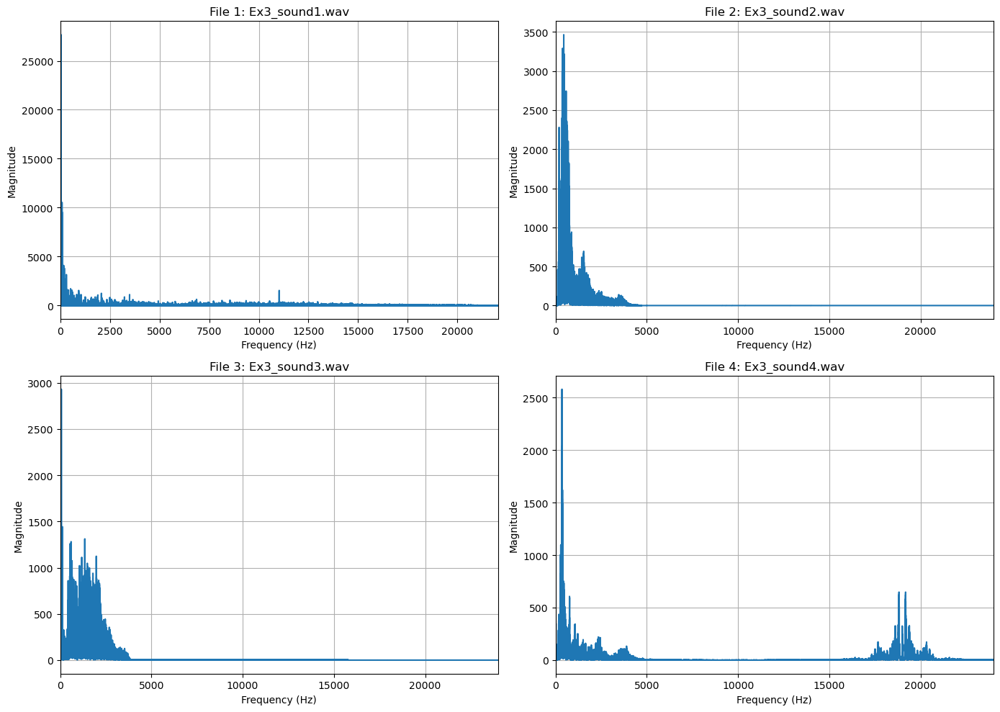
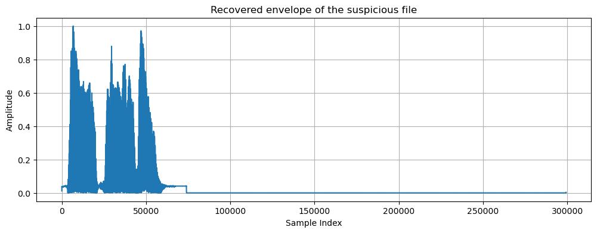
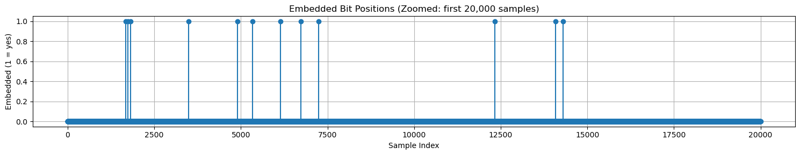

# Audio Steganography

Hiding and finding information inside sound with Python: detecting a code hidden at the top of the audible range of a recording, and hiding a text message in the least significant bits of another. Both algorithms are written from scratch with NumPy and SciPy, and Vosk is used only to transcribe the recovered code.

[](https://colab.research.google.com/github/ziadelh/audio-steganography/blob/main/audio_steganography.ipynb)



<sub>The spectrum of the four supplied recordings. Only file 4 has a second block of energy near 19 kHz, above where speech and music normally sit.</sub>

## What it does

**1. Finding a hidden code.** One of four recordings carries a four-digit code that was amplitude-modulated onto a carrier near 19 kHz, above what most people can hear, and mixed into the audio. A 6th-order Butterworth band-pass filter (15-20 kHz) keeps only that range. File 4 has 781 units of energy there, against 43, 0.02 and 0.0001 for the others, which is 18 times the next highest. Taking the envelope of the filtered signal with the Hilbert transform demodulates the carrier and brings the hidden speech back into the audible range, and the offline Vosk speech recogniser transcribes it as **"one eight nine one"**.



**2. Hiding a message.** The text *"An eye for an eye makes the whole world blind"* becomes 360 bits. Each pair of bits replaces the two least significant bits of one 16-bit sample, and the 180 samples are picked at random positions with a seeded generator instead of one after another. The seed and the message length are the key: with them the message comes back exactly, without them the bits are scattered across 407,280 samples.



| Check | Result |
|---|---|
| Suspicious file | `Ex3_sound4.wav`, 18x the 15-20 kHz energy of any other file |
| Recovered code | one eight nine one |
| Hidden message | extracted and identical to the original |
| Distortion | at most 3 out of 32,768 on 150 samples, signal-to-noise ratio 103.4 dB |

## Run it

Click the Colab badge, or run it locally:

```bash
pip install -r requirements.txt
jupyter notebook audio_steganography.ipynb
```

On the first run the notebook downloads the small English Vosk model (about 40 MB). Everything else is in the repo. The recovered audio and the audio with the hidden message are written to `output/`, so you can listen to both.

## Files

| File | Purpose |
|---|---|
| `audio_steganography.ipynb` | The whole project, with results saved in the notebook |
| `data/` | The five supplied recordings |
| `output/` | The recovered hidden speech and the recording that carries the hidden message |
| `docs/` | Charts used in this README |

## Credits

- The five recordings in `data/` were supplied with the course.
- Speech recognition: [Vosk](https://alphacephei.com/vosk/) with its small English model (Apache 2.0), downloaded when the notebook runs.

## Tech Stack

Python · NumPy · SciPy · Matplotlib · SoundFile · Vosk

## Author

Ziad Elhussein
